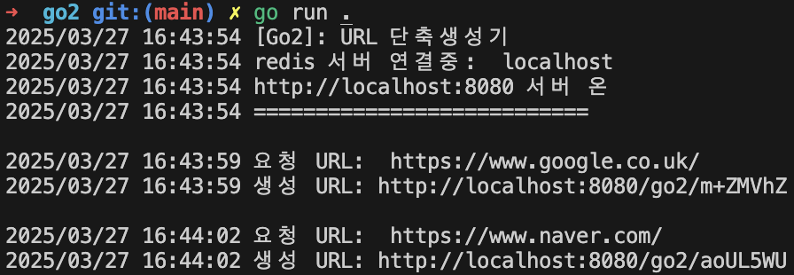

# Go2
Go로 만든 URL 단축생성기 **Go2**  



# 간단 원리
1. 사용자가 단축하고 싶은 URL을 입력한다.
2. 서버에서 단축 알고리즘 (여기서는 해시)을 사용하여 URL을 단축한다.
3. `단축시킨 URL`: `원래 URL` 쌍으로 DB(Redis)에 저장한다. (예. `go2.com/ABC`: `youtube.com`)
4. 사용자는 `단축시킨 URL`을 입력하면 `원래 URL`으로 리다이렉트 해준다.

# 사용한 기술
- [Go](https://go.dev/) (http, hash, base64 등)
- [Redis](https://redis.io/)
- [htmx](https://htmx.org/)
- [TailwindCSS](https://tailwindcss.com/)

# 빌드
1. redis다운로드 후 시작해주세요.
> `redis-server` 또는 `brew services start redis`

2. 환경변수 설정
`.env.example`을 `.env`로 변경
```env
REDIS_HOST="localhost:6379"
REDIS_PASSWORD=
URL_LENGTH=7
```

3. 라이브러리 다운로드
> `go mod tidy`

4. 시작 또는 빌드하기
> `go run .`
또는 
> `go build` 후 `./go2`

## redis 서버 수동 확인하기
서버를 먼저 시작해주세요.
```sh
# 키 검색
keys *

# 값 얻기
get {key}

# 값 설정하기
set {key} {value}

# 삭제
del {key}
```
